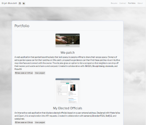

# Portfolio

## Description
This is my developer portfolio! It is built using React and Bootstrap and is a great place to get to know me and my work. It contains short descriptions of and links to a number of projects that I'm proud of, as well as links to my LinkedIn and Github. It's really a bit of a waste of the power of React, but React does make it dead simple to do some simple templating without having to set up a server. Check it out at https://elijah415hz.herokuapp.com/

## License
 

This application is covered by the MIT license.

